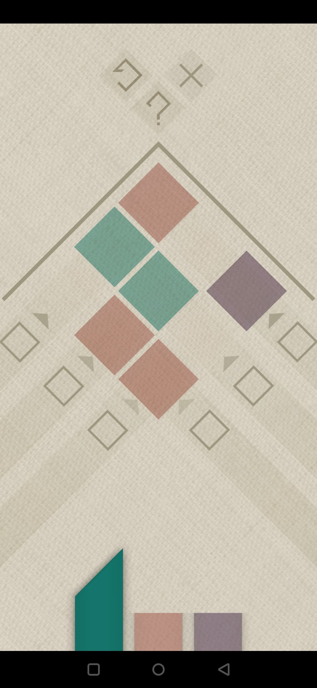
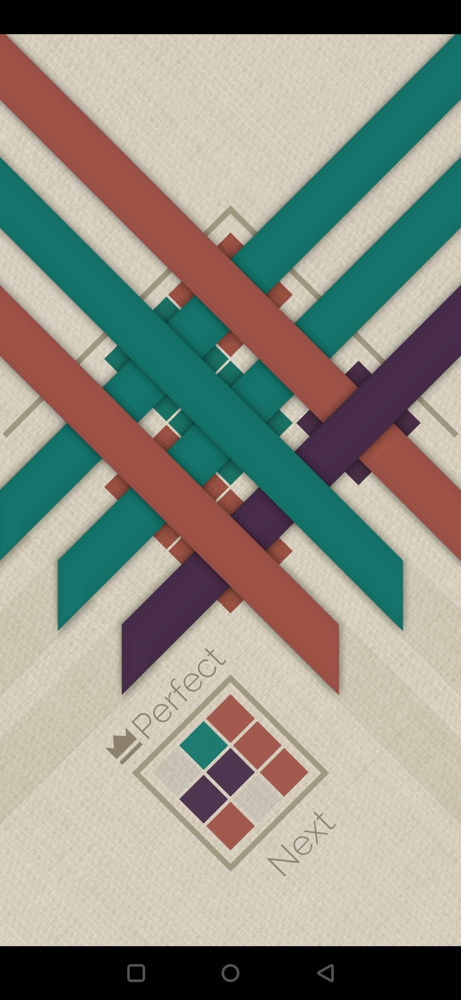

# Untangle

## About

Solve [Strata](http://www.graveck.com/strata/) puzzles like a (cheating) boss!

Heavily inspired by the [strata-solver](https://github.com/tranzystorek-io/strata-solver) project.
Written in some slick Rust.

## Usage

### Input format

A puzzle description consists of the following:

- First line contains `rows` and `columns` numbers
- Remaining lines contain the grid description (whitespace-delimited)

Color descriptions can be as follows:

|Code   |Color    |
|-------|---------|
|`*`    |Blank    |
|`y` `Y`|Yellow   |
|`r` `R`|Red      |
|`p` `P`|Purple   |
|`g` `G`|Green    |
|`o` `O`|Orange   |

> Note: obviously, color descriptions don't need to match the in-game ones, just need to be unique

Example:

```txt
4 4
p r p p
g g p g
r * r r
r r p g
```

The grid description should have the following orientation (using geographical directions):

```txt
      NW
   ---------
   |x x x x|
SW |x x x x| NE
   |x x x x|
   |x x x x|
   ---------
      SE
```

### Output format

A solution description consists of ordered mappings `<ROW> => <COLOR>`,
optionally preceded by a "blank moves" section, which shows rows mapped to the `*` wildcard.
The blank moves can be of any color and can be made in any order, with no impact on the solution's end result.

Row numbers shall be interpreted as follows:

```txt
  ---------
0 |x x x x|
1 |x x x x|
2 |x x x x|
3 |x x x x|
  ---------
   4 5 6 7
```

Example:

```txt
SOLUTION 1
0 1 => *
2 => Red
3 => Purple
4 => Red
5 => Green
```

### CLI

Here's how the help message looks:

```console
untangle <version>
A solver for Strata game puzzles

USAGE:
    untangle [OPTIONS] [input]

FLAGS:
    -h, --help       Prints help information
    -V, --version    Prints version information

OPTIONS:
    -n, --number <N>    Show only the first N solutions

ARGS:
    <input>    File to read from; defaults to STDIN if not provided
```

### Full example

Let's solve one of the puzzles:



First, create a puzzle description file:

```txt
3 3
* g r
r g *
r * p
```

Then we can run the solver:

```console
$ untangle -n 1 puzzle.txt

SOLUTION 1
0 1 => *
5 => Red
2 => Purple
3 => Red
4 => Green
```

Et voilà!


